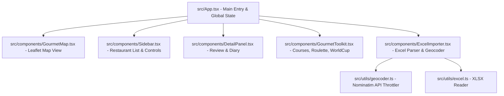

# 시스템 설계 및 아키텍처 (02_ARCHITECTURE)

이 파일은 대동맛지도 앱의 컴포넌트 아키텍처와 데이터 흐름을 정의하는 설계도입니다.

---

## 1. 프론트엔드 모듈 구조

## 2. 컴포넌트 명세
- `src/App.tsx`: 글로벌 상태 관리(restaurants, selectedRestaurant, unlockProgress 등) 및 사이드바/모달 가시성 제어.
- `src/components/GourmetMap.tsx`: 오픈스트리트맵 기반 지도 렌더링, 카테고리별 마커 드로잉, 핀 선택 시 팝업 및 Neon 하이라이트 제어.
- `src/components/Sidebar.tsx`: 검색 필터링(지역, 맛집 분류), GPS 주변 탐색, 맛집 제보 폼 제공.
- `src/components/DetailPanel.tsx`: 맛집 평점 및 설명, 더치페이 계산기, 미식 일기장 기록 및 LocalStorage 동기화.
- `src/components/GourmetToolkit.tsx`: 룰렛 픽, 월드컵 뱃지 해금 연동, 코스 최적화 드래그 정렬 및 공유.
